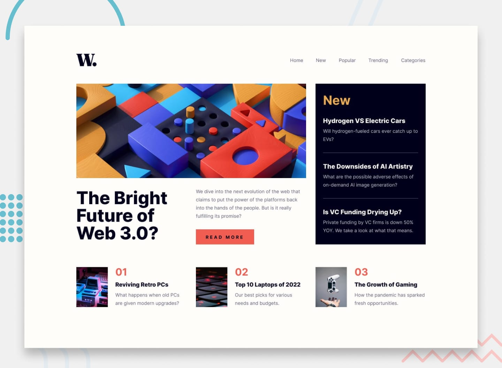
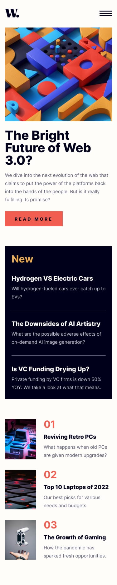

# News Homepage



A responsive news homepage built as a Frontend Mentor challenge. This project features a modern grid layout, mobile navigation menu, and dark/light theme support.

## Features

- **Responsive Layout** — Optimized for mobile (375px), tablet, and desktop (1440px+) viewports
- **Mobile Navigation** — Slide-in menu with overlay, close button, and Escape key support
- **Dark/Light Theme Toggle** — Persistent theme preference stored in localStorage
- **Accessibility** — Semantic HTML, ARIA labels, keyboard navigation, focus-visible states
- **Hover States** — Interactive elements have hover/focus visual feedback matching the design spec

## Dark/Light Theme Toggle

The dark/light theme toggle was built to improve the user experience by giving visitors control over their reading environment. Many users prefer darker interfaces for reduced eye strain, especially during extended reading sessions or in low-light environments.

### How It Works

- **CSS Custom Properties:** The entire color system is built on CSS variables in `:root`. When the toggle is activated, the `data-theme="dark"` attribute is applied to the `<html>` element, which overrides the background, text, and heading color variables. This means the theme switch propagates instantly across the entire page without needing multiple stylesheets or class toggles on every element.

- **JavaScript & localStorage:** The toggle button uses a click event listener to swap between `"light"` and `"dark"` themes. The user's choice is saved to `localStorage`, so when they return to the page, their preferred theme is restored automatically — no need to re-select it on every visit.

- **Inline SVG Icons:** Sun and moon SVG icons are embedded directly in the HTML. CSS handles their visibility — the sun icon shows in light mode and the moon icon shows in dark mode — so there's no need to swap image files.

- **Smooth Transitions:** Background, text, and heading colors transition smoothly (0.3s ease) so the switch feels polished and doesn't jar the user.

### Why It Makes the Project Better

1. **User Comfort:** Reading news articles is a text-heavy activity. A dark mode option reduces eye strain and makes the site more comfortable to use at night or in dim lighting.

2. **Modern UX Expectation:** Dark mode has become a standard feature users expect from modern websites. Including it demonstrates attention to current design trends and user preferences.

3. **Persistence:** Saving the preference to `localStorage` means users only need to set it once. This small detail greatly improves the experience because the site remembers their choice between sessions.

4. **No Flash of Unstyled Content:** The theme is applied immediately on page load by reading `localStorage` before rendering, so the correct theme is shown from the first paint without a jarring flash.

5. **Accessibility-Friendly:** The toggle respects reduced motion preferences and uses proper ARIA labels, making it usable with screen readers and keyboard navigation.

### Implementation Detail

```css
/* Light theme (default) colors */
:root {
  --clr-bg: hsl(36, 100%, 99%);
  --clr-text: hsl(236, 13%, 42%);
  --clr-heading: hsl(240, 100%, 5%);
}

/* Dark theme overrides — applied via data attribute */
[data-theme="dark"] {
  --clr-bg: hsl(240, 15%, 8%);
  --clr-text: hsl(233, 8%, 65%);
  --clr-heading: hsl(36, 100%, 99%);
}
```

All elements use `var(--clr-text)` and `var(--clr-heading)` instead of hardcoded colors, so the theme change cascades automatically through the entire page with a single attribute switch.

## Built With

- HTML5 — Semantic markup with `<picture>`, `<article>`, `<aside>`, `<nav>`
- CSS — Custom properties, CSS Grid, Flexbox, media queries, smooth transitions
- JavaScript — DOM manipulation, event handling, localStorage API
- Font: [Inter](https://fonts.google.com/specimen/Inter) (weights 400, 700, 800)

## Screenshots

| Mobile | Desktop |
|--------|---------|
|  |  |

## What I Learned

- Using CSS Grid for complex magazine-style layouts with a sidebar
- Implementing a `<picture>` element with `<source>` for responsive image switching
- Building a slide-in mobile navigation with smooth CSS transitions and JavaScript toggle
- Creating a dark mode toggle with CSS custom properties and localStorage persistence

## Author

- GitHub — [NightWing3099](https://github.com/NightWing3099)
- Frontend Mentor — [@NightWing3099](https://www.frontendmentor.io/profile/NightWing3099)

## Acknowledgments

Challenge provided by [Frontend Mentor](https://www.frontendmentor.io). Design files and assets included in the `/design` and `/assets` folders.